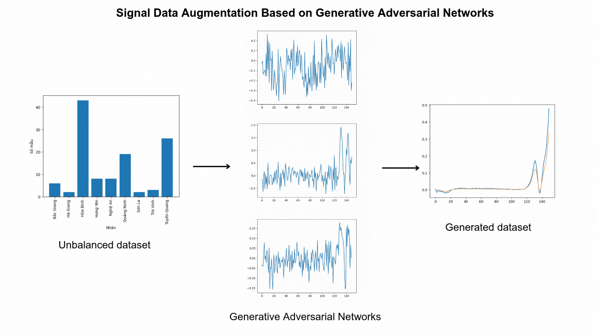

# GANSDA - Generative Adversarial Networks for Spectral Data Augmentation

## 🚀 Introduction
GANSDA (Generative Adversarial Networks for Spectral Data Augmentation) is a deep learning project that leverages GANs to generate synthetic spectral data. This approach enhances data diversity, improves model performance, and addresses data scarcity issues in spectral analysis.

## 📂 Repository Structure
📦 GANSDA ├── 📁 data # Raw spectral datasets (CSV) ├── 📁 models # Trained GAN models (H5) ├── 📁 notebooks # Jupyter Notebooks for training and evaluation ├── 📁 reports # Documentation and result analysis ├── 📝 README.md # Project documentation └── 🎞️ cover.gif # Visualization of generated spectra
